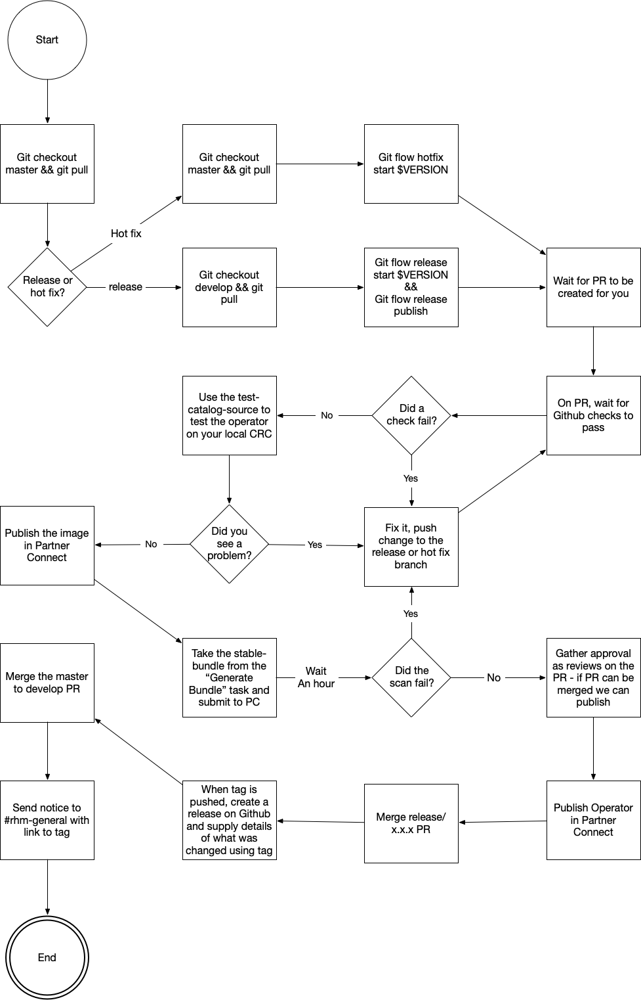
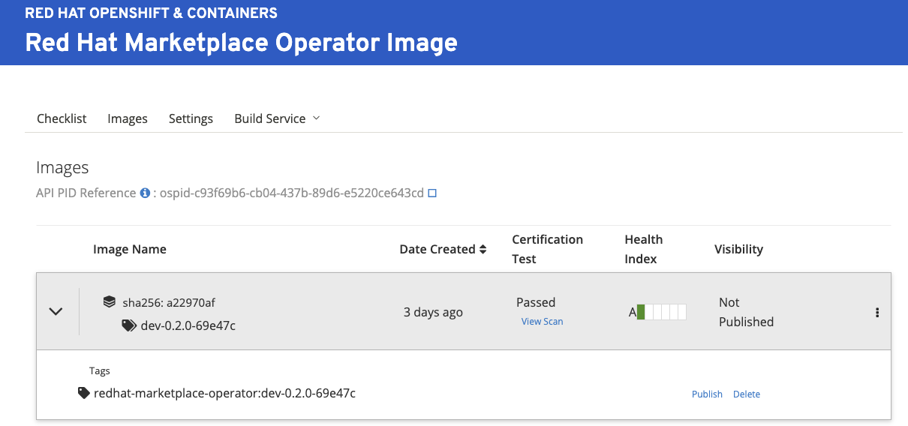
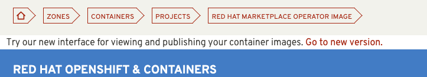
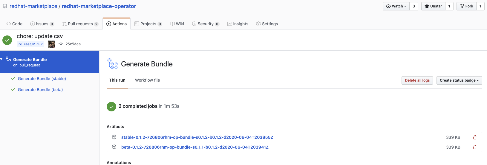
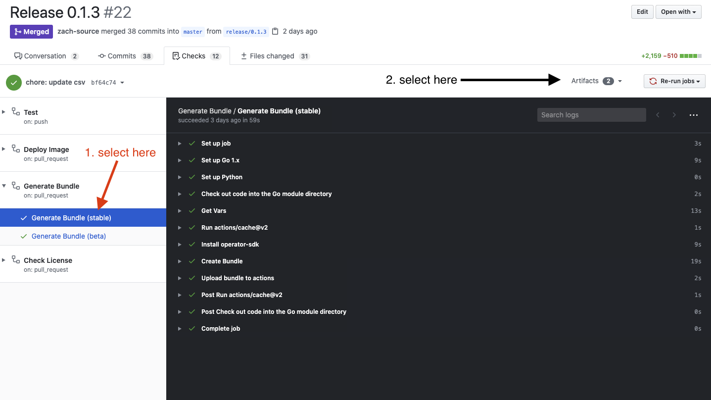
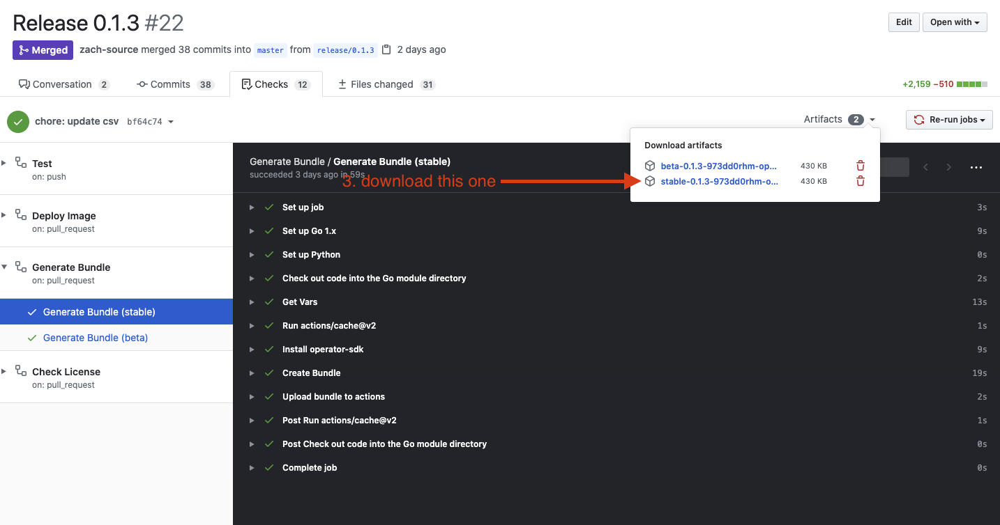
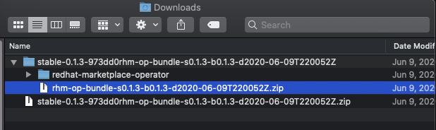
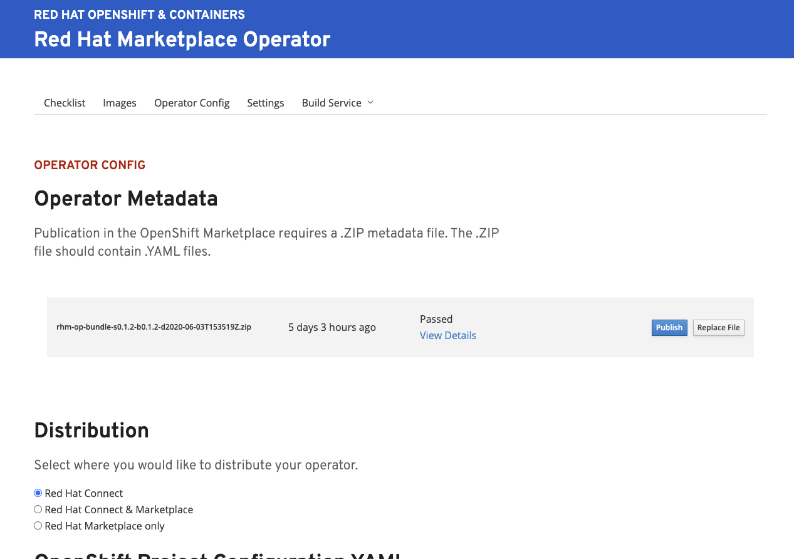
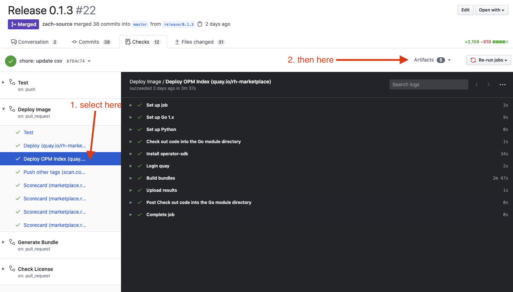
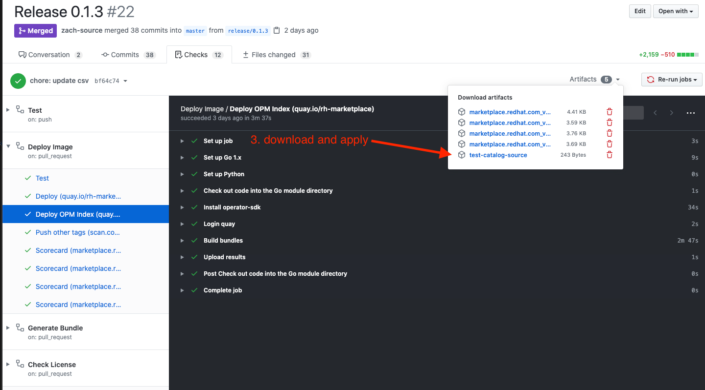

# Release Processes

<!-- markdown-toc start - Don't edit this section. Run M-x markdown-toc-refresh-toc -->

**Table of Contents**

- [Release Processes](#release-processes)
  - [Prerequisites](#prerequisites)
    - [How to set up git flow plugin?](#how-to-set-up-git-flow-plugin)
  - [Branches](#branches)
  - [Automatic Releases](#automatic-releases)
    - [Release](#release)
    - [Hotfix](#hotfix)
  - [Manual Releases](#manual-releases)
    - [Prerequisites](#prerequisites-1)
    - [Release or Bugfix](#release-or-bugfix)
    - [Hotfix](#hotfix-1)
  - [Updating Partner Connect](#updating-partner-connect)
    - [Troubleshooting](#troubleshooting)
      - [Image verification step fails](#image-verification-step-fails)
      - [Scorecard step fails](#scorecard-step-fails)
      - [A CR test isn't running properly](#a-cr-test-isnt-running-properly)
      - ["Owned CRDs have resources listed failed"](#owned-crds-have-resources-listed-failed)
  - [Testing Latest Builds](#testing-latest-builds)
  - [Workflows](#workflows)

<!-- markdown-toc end -->

The Red Hat Marketplace operator uses a branch model called git-flow for release management.

You can read more about git flow [here](https://nvie.com/posts/a-successful-git-branching-model/) and there is a handy cheat sheet [here](https://danielkummer.github.io/git-flow-cheatsheet/index.html).

## Prerequisites

To perform all the actions for automatic install you will need to have the git flow plugin installed locally.

1. [gitflow](https://github.com/petervanderdoes/gitflow-avh/wiki/Installing-on-Mac-OS-X)

### How to set up git flow plugin?

Once the plugin is installed, run this command:

```sh
git flow init -d
```

This will set up the plugin with the default rules we use.

## Branches

| branch     | use                                                                                                           |
| :--------- | :------------------------------------------------------------------------------------------------------------ |
| master     | Master branch is current stable version.                                                                      |
| develop    | Develop branch is where all future work is branched from and merged to.                                       |
| feature/\* | Feature branches for future work. Start off develop.                                                          |
| bugfix/\*  | Bug fixes for the next release. Lower priority. Branch from develop.                                          |
| hotfix/\*  | Hot fix for production code. High priority. Branch from master.                                               |
| release/\* | Release branches for the next release. Hotfix is also a release branch. Can only be one. Branch from develop. |

When enough features are ready, a release branch is created off of develop. Release branch is worked until all testing is completed as a beta release. Once the beta release is stable, the release is merged into master. Merge to master creates the next official stable release.

Hotfixes are started off of master. Bugfixes off of stable.

## Automatic Releases

Here is a convenient flow chart to use for releasing:



### Release

1. Sync your master branch.

   ```sh
   git fetch
   git checkout master
   git pull
   ```

1. Start from 'develop' branch.

   ```sh
   git checkout develop
   git pull
   ```

1. Run

   ```sh
   git flow release start $(make current-version)
   git flow release publish
   ```

   A new branch called release/x.x.x will be made for you and pushed to the repository.

1. Once the branch is pushed, a PR will be generated for you.

1. The build will build and push images. Different workflows will generate assets for you to use as well.

   - test-catalog-source.yaml is generated to allow local testing before publishing
   - bundles for submission to Partner Connect are also generated
   - results from operator-sdk scorecard tests

1. Once the PR checks finish, verify the checks for the PR are passing.

1. Test the newly generated bundles using the `test-catalog-souce`. For more info see [testing latest build](#testing-latest-builds).

1. Upload your generated bundle to Partner Connect following these steps [partner connect](#updating-partner-connect).

1. When the release PR is approved and testing complete, publish the bundle in Partner Connect.

1. Merge the release PR.

1. A new tag with the release version will be created. Create a release in Github for this tag by selecting the tag and creating a release. See [0.1.2](https://github.com/redhat-marketplace/redhat-marketplace-operator/releases/tag/0.1.2) for an example of the content.

1. A PR to merge master to develop will be gnerated. Merge this PR.

1. You're done. Spread the good news about a successful release.

### Hotfix

Same as release, but change git flow commands to `git flow hotfix` and start from master branch.

## Manual Releases

### Prerequisites

To do all the manual actions. You will need to have these additional local commands.

1. [operator-sdk](https://sdk.operatorframework.io/docs/install-operator-sdk/)
1. [operator-courier](https://github.com/operator-framework/operator-courier)

### Release or Bugfix

_Warning_: to do these steps you need pull/push access to master/develop branch. And admin access to the docker registry. Only to be done if github actions are down.

1.  Start from 'develop' branch.

    ```sh
    git checkout develop
    git pull
    ```

1.  Run

    ```sh
    git flow release start $(make current-version)
    ```

    A new branch called release/x.x.x will be made for you and pushed to the repository.

1.  Generate the csv files and commit them. The release branch should be used to create manifests for the beta channel. Updates to the bundle in Partner connect will only impact beta.

    ```sh
    make generate-csv
    git add ./deploy/olm-catalog
    ```

1.  Now you need to bundle the images for the release

    ```sh
    export IMAGE_REGISTRY=quay.io/rh-marketplace
    export OPERATOR_IMAGE_TAG=$(make current-version)

    make build push publish-image bundle
    ```

1.  Upload your bundle to [partner connect](#updating-partner-connect). And publish it when it passes. The bundle command will leave a zip file for upload in the `./bundle`

1.  Publish your images in Partner Connect and wait for the Operator scans to pass.

1.  If the operator scan fails, see the [troubleshooting section](#troubleshooting). Otherwise finish the release.

1.  Once the release is finished. Run these commands:

    ```sh
    git flow release finish $(make current-version)
    ```

1.  Create the release using the published tag. Notify #rhm-general channel.

### Hotfix

Same as release, but change git flow commands to `git flow hotfix` and start command from master branch.

## Updating Partner Connect

Before releasing, we need to do a few steps in partner connect.

1. Go into [Partner Connect](https://connect.redhat.com)
1. Navigate to the "Red Hat Marketplace Operator Image" project.
1. Find the tag associated to the release and publish it.
   
   - To get to this UI, you'll need to select "Try our new interface link"
     
1. Download the bundle from the [Generate Bundle](https://github.com/redhat-marketplace/redhat-marketplace-operator/actions?query=workflow%3A%22Generate+Bundle%22) action.
   

   1. Go to the checks > select "Generate Bundle" workflow > Select artifacts
      
   1. Download latest artifact with the prefix `stable-`
      

   - The bundle with `stable-` is for updating the stable channel. This is the one you will primarily use.
   - The bundle starting with `beta-` is for updating the beta channel. This not working on the Partner Connect side.
   - Also notice the bundle describes what it's deploying `bundle-s0.1.2-b0.1.2` says stable is version 0.1.2 and beta is 0.1.2. This helps verify you're not making mistake.
   - The zip file for the bundle has a zip file in it, you'll want to use it to deploy.
     

1. Then navigate to the "Red Hat Marketplace Operator" project.
1. Once inside the operator project, select `Operator Config`.
1. Now upload the zip file included in the bundle you downloaded from the action download.
   
1. You'll need to make sure the image is published and all the scorecard tests pass.
1. If all the tests are passed and you're read, select publish and your new version of the operator will be released.

### Troubleshooting

If your upload fails its scan, here are some common problems:

#### Image verification step fails

This is the last step in the process, normally it'll say quay.io/xx/xx@sha256... cannot be found. This normally means that the image you used was published in Partner Connect. Go back to the [Updating Partner Connect](#updating-partner-connect) and retry the first few steps. Investigating the image's sha may also be required. You can use the [skopeo]() tool to inspect images for their digests running `skopeo inspect docker://${YOUR_IMAGE}`.

#### Scorecard step fails

We run the scorecard as well in our Deploy [workflow](#workflows). You'll want to verify that the results of our scorecards tests are valid as well. There can be some false-positive results so a particular test failing does not always mean it's a bad manifest. If the same test is failing, fixing it for our runs will likely fix it for the manifest scanning on Partner Connect.

#### A CR test isn't running properly

Sometimes if the example CRs in 'deploy/crds' is updated to the same name as other resources we deploy then the test will fail. This failure normally comes through as `xx resource already exists`. Double check the names are example- or otherwise unique.

#### "Owned CRDs have resources listed failed"

You can ignore this one, will not stop certification.

## Testing Latest Builds

On any branch build of Deploy, you can download an bundle index with just that release in it.

1.  Go to checks > Select drop down for "Deploy OPM Index" under the "Deploy Image" workflow > Select Artifacts
    
1.  Download the "test-catalog-source.yaml" artifact, unzip and apply the YAML to your cluster
    
1. Test source creates a new provider in Operator Hub. On Openshift <= 4.3, it will be under the "Custom" type. On Openshift 4.4 >= it will be "RHM Test".

1. To install latest, you will need to install the beta channel. It's best to install stable first then upgrade to beta at least once to verify upgrade.

## Workflows

Each workflow perform specific tasks on different branches. Together they help build and deliver software.

| Workflow            | Git Action | Branches                                                              | Description                                                                                              |
| :------------------ | :--------- | :-------------------------------------------------------------------- | :------------------------------------------------------------------------------------------------------- |
| Bump Version        | Push       | develop, hotfix/\*\*                                                  | Bumps version when it detects a tag on develop that's already been created in git                        |
| Create Manifest     | Push       | release/\*\*, hotfix/\*\*                                             | Creates the new versions manifest and commits it to the branch                                           |
| Deploy              | Push       | master, develop, release/\*\*, hotfix/\*\*, feature/\*\*, bugfix/\*\* |                                                                                                          |
| Deploy/Deploy OPM\* | Push       | Same as deploy                                                        | Creates the bundle image for testing                                                                     |
| Deploy/Scorecard\*  | Push       | Same as deploy                                                        | Runs the operator-sdk scorecard as is available on the Partner connect                                   |
| Generate Bundle     | PR         | master                                                                | Generate the bundle data as zip files for releasing to Partner Connect                                   |
| License             | Push       | All                                                                   | Verifies all files have the appropriate license                                                          |
| Release             | Push       | master                                                                | Tags new releases on master branch and creates sync from master to develop when new commits are present. |
| Test                | Push       | All                                                                   | Runs unit tests                                                                                          |
